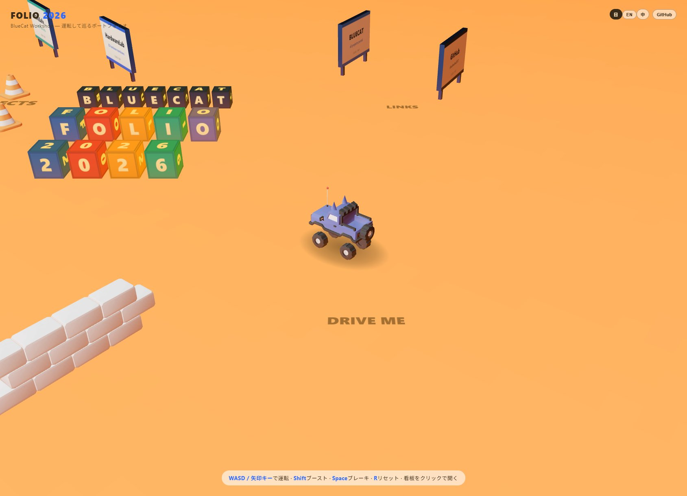

<div align="center">

# 🚙 FOLIO 2026

### ポートフォリオは、読むものじゃない。**運転するものだ。**

小さな猫耳カーでアクセルを踏んで、看板にぶつかって、積み木を蹴散らしながら作品を巡る<br>
**物理エンジン搭載の 3D ドライブ・ポートフォリオ**

[](https://shushuitie2017.github.io/folio-2026/)


<a href="https://shushuitie2017.github.io/folio-2026/">
  
</a>

**WASD で運転 · Shift でブースト · Space でブレーキ · R でリセット · 看板をクリックで作品が開く**

</div>

---

## ✨ なにこれ？

| | |
|---|---|
| 🏎️ **本物の車両物理** | RaycastVehicle によるサスペンション・ドリフト・横転からの自動復帰。「もう一周走りたくなる」ハンドリングをチューニング済み |
| 🎳 **全部倒せる** | タイトルの積み木、プロジェクト看板、レンガの壁、ボウリングのピン——世界にあるものはすべて物理オブジェクト。轢き倒してOK |
| 🐱 **アンテナが揺れる** | 加速するとアンテナが物理っぽく揺れる（実は物理エンジン外の手書きアニメ：逆加速度駆動＋復元力）。屋根には猫耳 |
| 💡 **ライト0灯で60FPS** | 全シーン無照明。matcap 材質＋2×2ピクセルのグラデーション床で、スマホでも滑らか |
| 📦 **軽量アセット** | MIT ライセンスの Draco 圧縮ローポリ素材（車まるごと 50KB）＋看板や文字ブロックは実行時にコードで生成 |
| 🌐 **三言語 UI** | 日本語 / English / 中文 切り替え |

## 🎮 遊びかた

| 操作 | キー / タッチ |
|---|---|
| 運転 | `W A S D` / 矢印キー（スマホ：左画面ジョイスティック＋▲▼ペダル） |
| ブースト | `Shift` |
| ブレーキ | `Space` |
| 世界をリセット | `R` |
| ズーム | マウスホイール / ピンチ |
| 作品を開く | 看板をクリック / タップ |

## 🔧 動かす

```bash
pnpm install
pnpm dev      # http://localhost:5031
pnpm build    # 型チェック + dist/ 出力
```

## 🏗️ しくみ（5層アーキテクチャ）

```
┌─ 描画層     matcap 材質 + 疑似バウンスライト + 2×2 DataTexture 床（照明ゼロ）
├─ 物理層     cannon-es RaycastVehicle + プリミティブ代理形状 + sleep 戦略
├─ 内容層     セクション制：JSON データ駆動の看板・積み木・ボウリング場
├─ 操作層     キーボード＋タッチジョイスティック、弾性追従カメラ
└─ 空気感層   しっぽ揺れ・砂埃パーティクル・ブレーキランプ・偽ブロブ影
```

ポイントは**物理と見た目の完全分離**：物理エンジンは箱・円柱・球しか知らず、毎フレーム座標だけを見た目側へ同期する。静止物は全部 `sleep()` で寝かせておくので、衝突判定のコストは「いま動いているもの」の分しか払わない。

## 🌏 English / 中文

**EN** — A drivable 3D portfolio: steer a little cat-eared truck, crash into project boards, plow through a brick wall, and go bowling. Real vehicle physics (cannon-es RaycastVehicle), zero lights — MIT-licensed draco-compressed low-poly assets plus boards and letter blocks generated in code at runtime. `pnpm i && pnpm dev` to run locally.

**中文** — 一个「开车逛」的 3D 作品集：驾驶小猫耳皮卡撞倒展板、冲穿砖墙、打保龄球来浏览项目。真实车辆物理（cannon-es RaycastVehicle），全场景零灯光——MIT 授权的 Draco 压缩低模素材 + 展板文字积木运行时代码生成。`pnpm i && pnpm dev` 本地即跑。

---

<div align="center">

**BlueCat Workshop** · [bluecatbot.com](https://bluecatbot.com) · [GitHub @shushuitie2017](https://github.com/shushuitie2017)

MIT License

</div>
