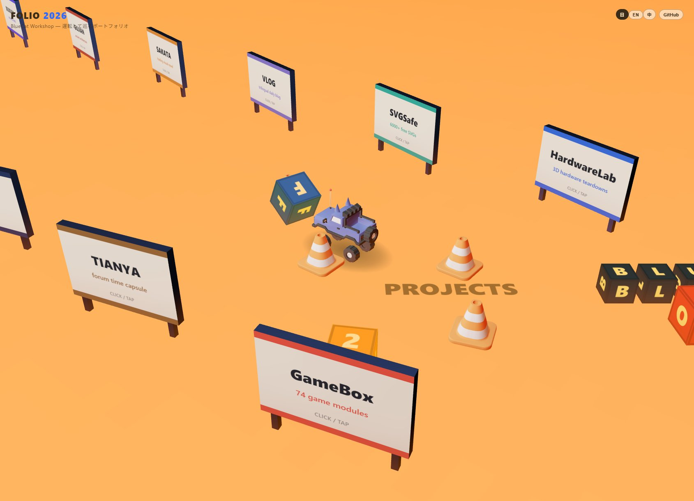

<div align="center">

# 🚙 FOLIO 2026

<a href="https://shushuitie2017.github.io/folio-2026/">
  
</a>

> *「ポートフォリオは、読むものじゃない。運転するものだ。」*


**スクロールの代わりにアクセルを踏む——猫耳トラックで看板を倒し、レンガ壁を突き破り、ボウリングを蹴散らしながら 12 作品を巡る、本物の車両物理つき 3D ポートフォリオ。**

<sub>Three.js + cannon-es + TypeScript + Vite · ライト 0 灯 · 車まるごと 50KB</sub>

### [▶ 今すぐ運転する](https://shushuitie2017.github.io/folio-2026/)

[こんな感じ](#-こんな感じ) · [操作](#-操作) · [手元で動かす](#-手元で動かす) · [特徴](#-特徴) · [しくみ](#-しくみ) · [作者](#-作者について)

</div>

---

## 🎬 こんな感じ

<div align="center">
  <a href="https://shushuitie2017.github.io/folio-2026/">
    
  </a>
</div>

タイトルの積み木に突っ込むと「F」が宙を舞い、コーンが転がり、看板は轢き倒せる。**世界にある 59 個のオブジェクト全部が物理で動く——そして倒した看板をクリックすると、その作品サイトが開く。**

## 🎮 操作

| 操作 | キー / タッチ |
|---|---|
| 運転 | `W A S D` / 矢印キー（スマホ：左画面ジョイスティック＋▲▼ペダル） |
| ブースト | `Shift` |
| ブレーキ | `Space` |
| 世界をリセット | `R` |
| ズーム | ホイール / ピンチ |
| 作品を開く | 看板をクリック / タップ |

## 🔧 手元で動かす

```bash
pnpm install && pnpm dev   # → http://localhost:5031
```

<details>
<summary>ビルド / プレビュー</summary>

```bash
pnpm build     # 型チェック + dist/ 出力
pnpm preview   # 本番ビルドの確認
```
</details>

## ✨ 特徴

| | |
|---|---|
| 🏎️ **本物の車両物理** | RaycastVehicle のサスペンション・ドリフト・横転からの 1 秒自動復帰。手を離すと 1〜2 秒でピタッと止まる調整済みハンドリング |
| 🎳 **全部倒せる** | 積み木 16 個・看板 14 枚・ボウリングピン 10 本・レンガ 12 個・コーン 4 本——静止物は全部 sleep して、起きてる剛体は平常時 **1 個だけ** |
| 💡 **ライト 0 灯で 60 FPS** | 照明なし。matcap 材質＋2×2 ピクセルのグラデーション床で描画コストほぼゼロ（draw call 144 / 約 1 万トライアングル） |
| 🐱 **アンテナが揺れる** | 加速すると赤玉アンテナがぷるぷる揺れる。物理エンジン外の手書きアニメ：逆加速度駆動＋復元力 |
| 📦 **Draco 圧縮ローポリ** | 車 5 パーツ合計 50KB。看板・文字ブロック・地面マーカーは実行時に canvas で生成 |
| 🌐 **三言語 UI** | 日本語 / English / 中文、ワンクリック切り替え |

## ⚙️ しくみ

1. **物理と見た目は完全分離** —— 物理エンジンは箱・円柱・球しか知らない。`collision.glb` の命名規約（`cube_*` / `cylinder_*` / `sphere_*` / `center_*`）から代理形状を組み、毎フレーム座標だけを見た目側へ一方通行で同期する
2. **matcap で照明を偽装** —— メッシュ名 `shadeRed_*` → 赤 matcap のように材質を割り当て。ライト計算もシャドウマップも存在しない
3. **sleep 戦略** —— 静止オブジェクトは生成時に全部 `body.sleep()`。衝突コストは「いま動いているもの」の分しか払わない
4. **内容はデータ駆動** —— 看板 12 枚は `src/projects.ts` の配列。差し替えれば世界が組み変わる

## 🙅 正直な限界

- 音はまだ鳴らない（エンジン音・衝突音なし）
- セーブなし——倒した看板はリロードか `R` で元通り
- 実行時 canvas 生成のテキストはフォントが環境依存（Segoe UI / ヒラギノ前提）

## 👤 作者について

**蓝猫 BlueCat** — AI-native builder。ブラウザで動く 3D・ゲーム・ツールを量産中。

| | |
|---|---|
| 🐙 GitHub | [@shushuitie2017](https://github.com/shushuitie2017) |
| 🏠 ポータル | [bluecatbot.com](https://bluecatbot.com) |


### 🚀 ほかにも作ってます

| プロジェクト | 一言 |
|---|---|
| [HardwareLab](https://hardware.bluecatbot.com) | 3D で分解して学ぶハードウェア教室（66 部品・16 アニメ） |
| [GameBox](https://gamebox.bluecatbot.com) | ブラウザ 3D ゲームの積み木 74 モジュール |
| [MODKEYS](https://keyboard.bluecatbot.com) | 3D カスタムキーボード・コンフィギュレータ |
| [SVGSafe](https://svg.bluecatbot.com) | ライセンス明記の無料 SVG 素材 6000+ |

## ライセンス

**MIT —— ご自由にどうぞ。**

---

<div align="center">

*「ポートフォリオは、読むものじゃない。運転するものだ。」*

**[▶ 運転しに行く](https://shushuitie2017.github.io/folio-2026/)**

</div>

## English

**A portfolio you drive, not scroll.** Steer a cat-eared truck through a knockable 3D world: ram the letter blocks, plow through a brick wall, go bowling — then click any board you knocked over to open that project. Real vehicle physics (cannon-es RaycastVehicle), zero lights at 60 FPS via matcaps, the whole car in 50KB of draco-compressed GLB. [Drive it now](https://shushuitie2017.github.io/folio-2026/) or run locally with `pnpm i && pnpm dev`.

## 中文

**不用滚动、踩油门逛的作品集。** 开一辆猫耳皮卡在可撞倒的 3D 世界里横冲直撞：撞散标题积木、冲穿砖墙、打保龄球——撞倒的每块展板点一下就打开对应项目。真实车辆物理（cannon-es RaycastVehicle），零灯光 matcap 渲染 60 FPS，整辆车只有 50KB。[现在就去开](https://shushuitie2017.github.io/folio-2026/)，或 `pnpm i && pnpm dev` 本地跑。
